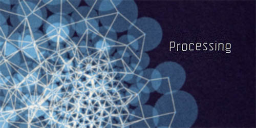
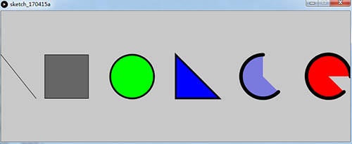
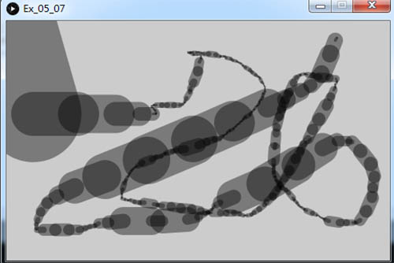
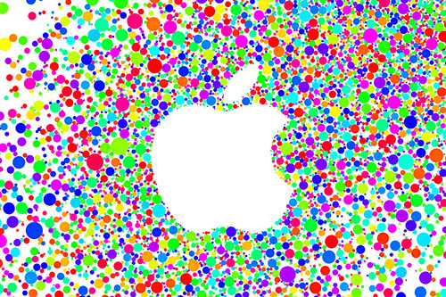

# 0  几句话概述
Processing是为开发面向图形的应用而生的简单易用的编程语言和编程环境
特点是算法动画和即时交互，应用于复杂数据可视化、视觉设计和原型开发
Processing是基于Java开发的，但代码不同于Java，使用时需要先配置Java环境
Processing 的工程界面是Sketch（代码素描本），文件格式.Pde，
支持多运行模式:Java模式输出桌面应用，Android模式输出安卓程序，JavaScript输出嵌入Web的Applet
Setup()设定窗口大小；draw()绘制图像；右键函数有官方文档；“//”用来注释代码
<!-- more -->

# 1  认识Processing

Processing 在 2001 年诞生于麻省理工学院（MIT）的媒体实验室，主创者为 Ben Fry 和 Casey Reas，
此外，来自Carnegie Mellon、洛杉矶的加利福尼亚大学以及迈阿密大学等学者也做出了贡献
Processing 的最初目标是开发图形的 sketchbook 和环境，用来形象地教授计算机科学的基础知识
之后，它逐渐演变成了可用于创建图形可视化专业项目的一种环境
如今，围绕它已经形成了一个专门的社区，致力于构建各种库以供用这种语言和环境进行动画、可视化、网络编程以及很多其他的应用
Processing 是一个很棒的进行数据可视化的环境，具有简单的接口、功能强大的语言以及一套丰富的用于数据以及应用程序导出的机制
Processing 运行于 GNU/Linux® 以及 Mac OS X 和 Windows® 上，并且支持将图像导出成各种格式
对于动态应用程序，甚至可以将 Processing 应用程序作为 Java™ applet 导出以用在 Web 环境内


# 2  如何安装Processing

配置Java环境，JDK包下载：<u>http://java.sun.com</u>，环境配置教程：<u>http://wenku.baidu.com/view/a2e732caa1c7aa00b52acb9b.html</u>
Processing最新版本下载地址：<u>http://processing.org/download</u>，解压文件，打开processing.exe即可开始使用
Processing的工程也非常文艺地取名为“素描本”——Sketch
Toolbar工具栏：运行和停止，模式选择：多种运行模式，默认为Java，还有Android和JavaScript等模式
Console 控制台：黑色区域上方是信息区，运行时的PDE状态、出错信息等都会显示在这里，黑色区域是控制台


# 3  绘制基本图形

```java
void setup(){
  size(800, 300);//the size of the window
  // The upper left corner is (0, 0)
}
void draw(){
  background(200);
  fill(255);
  strokeWeight(1); // Stroke weight to 1 pixels
  line(0,100,80,200);
  fill(102);  
  rect(100, 100, 100, 100);//draw a rectangle
  strokeWeight(4); // Stroke weight to 4 pixels
  //(0, 100) is the location of upper left point and (100, 100) is the lower right conner point
  fill(0,255,0);//green
  ellipse(300, 150, 100, 100);//draw a ellipse
  //160, 150 is the location of center, 260 and 20 represent width and height
  fill(0,0,255);//blue
  triangle(400,100,400,200,500,200);
  fill(0,0,255,100);//light blue, the forth parameter is transparency
  strokeWeight(8); // Stroke weight to 8 pixels
  smooth();  
  arc(600,150,100,100,QUARTER_PI, PI+HALF_PI);//clockwise, QUARTER_PI to PI+HALF_PI
  noSmooth();
  fill(255,0,0);//red
  arc(750,150,100,100,radians(45),radians(360));
}
```


# 4  绘制复杂图形

## (1)  针和线

```java 
size(480, 120);
background(0);
fill(255);
stroke(102);
for (int y = 20; y <= height-20; y += 10) {
  for (int x = 20; x <= width-20; x += 10) {
    ellipse(x, y, 4, 4);
    // Draw a line to the center of the display
    line(x, y, 240, 60);
  }
}
```


## (2)  响应鼠标

```java 
void setup() {
  size(480, 300);
  stroke(0, 102);
}

void draw() {
  float weight = dist(mouseX, mouseY, pmouseX, pmouseY);
  strokeWeight(weight);
  line(mouseX, mouseY, pmouseX, pmouseY);
}
```


## (3)  加载图片

```java
//作者：鳥仟一·超傑   来源：知乎
//链接：https://www.zhihu.com/question/27917305/answer/46652009
PImage img;
ArrayList <Circle> circles = new ArrayList <Circle> ();
int shiftx, shifty;
void setup(){
  //noLoop();
  colorMode(HSB);
  background(255);
  smooth();
  noStroke();
  img = loadImage("Apple_logo_black.jpg");
  //size((int (img.width*2), (int) (img.height*1.2));
  size(1200, 800);
  shiftx = width/2-img.width/2;
  shifty = height/2-img.height/2;
  img.loadPixels();
  //image(img,shiftx,shifty);
}
void draw(){
  //img.loadPixels();
  background(255);
  //image(img,shiftx,shifty);
  if(circles.size()>0){
    for(Circle c : circles){
      c.display();
    }
  }
  float xn, yn;
  while(true){
    xn = (randomGaussian()*200)+mouseX;
    yn = (randomGaussian()*200)+mouseY;
    int xns,yns;
    xns = (int) (xn-shiftx);
    yns = (int) (yn-shifty);
    if (xns<0 || xns>=img.width || yns<0 || yns>=img.height) break;
    int loc = xns + yns*img.width;
    float b=brightness(img.pixels[loc]);
    if(b>50){
      break;
    }
  }
  boolean sign = true;
  for(Circle c:circles){
    if(dist(xn,yn,c.x,c.y)<c.r+2){
      sign = false;
      break;
    }
  }
  if(sign){     
    Circle cir = new Circle(xn,yn);
    cir.grow(randomGaussian()*5+10);
    circles.add(cir);
  }
}

class Circle{
  float x,y,r;
  color c;
  Circle(float xin, float yin){
    x = xin;
    y = yin;
    c = color(random(255),255,255);
  }
  void display(){
    noStroke();
    fill(c);
    ellipse(x,y,2*r,2*r);
  }
  void grow(float rmax){
    for(float ri=2; ri<rmax; ri+=1){
      r = ri;
      boolean sign1 = false;
      for(Circle c : circles){
        if(dist(x,y,c.x,c.y) <= c.r+r){
          sign1 = true;
          break;
        }
      }
      if(sign1){
        break;
      }
      boolean sign2 = false;
      for(int i=0; i<360; i++){
        float rad = radians(i);
        float xa = x+cos(rad)*r;
        float ya = y+sin(rad)*r;
        int xs = (int) (xa-shiftx);
        int ys = (int) (ya-shifty);
        if(xs<0 || xs>=img.width || ys<0 || ys>=img.height) break;
          int loc = (int) (xs+ys*img.width);
          float b = brightness(img.pixels[loc]);
          if(b<50){
            sign2 = true;
            break;
          }
        }
      if(sign2){
        break;
      }
    }
  }
}
void mousePressed(){
  save("apple2.png");
}
```


#  写在后面

Processing是我偶然看到[城室科技 | CitoryTech](https://zhuanlan.zhihu.com/citorytech?topic=%E5%8D%B0%E5%BA%A6)的文章，文中作者提到的可视化软件
通过查找相关资料，看到了Processing的功能特别适合算法可视化和交互设计就喜欢上了
总而言之，Processing是一款有趣的可视化软件，轻编程重设计，很好很强大
