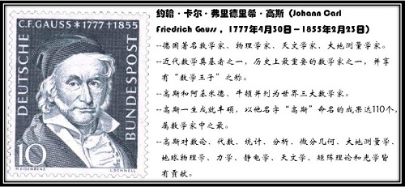

>在概率论和统计学中，高斯过程是指观测发生在连续域（例如：时域、空间域）中的一种特殊的概率模型

<!-- more -->

# 1  基本概念

*  在高斯过程，连续的输入空间的任何点与正态分布的随机变量相关，而且任何随机变量的有限集合满足多重正态分布，例如变量间的任意线性组合是正态分布，高斯过程分布是所有随机变量在连续域中的联合分布
*  在机器学习理论中，针对于推广训练数据（generalize train data）的算法，如果学习方法在对系统发出请求之前进行，称为急切学习（eager learning），如果学习方法滞后于对系统的请求，称为懒惰学习（lazing learning），K近邻算法就是典型的懒惰学习方法 
*  懒惰学习方法一般模型可移植性强，适用于不同的问题域，但要求较大空间来实时保存训练数据集，因为缺少对数据集合的抽象而使得预测过程计算量大。懒惰分类器适用于数据集的特征较少的情况 
*  因此，从机器学习算法的观点看，高斯过程采用懒惰学习的方式来度量样本间的相似度（核函数），从而基于训练数据预测位置观测输入的结果。预测结果往往是边缘分布（多个概率分布函数的累加） 
*  函数空间视角（function-space view）：高斯过程可以看作是基于多个函数定义分布，并在函数空间做推断分析 

# 2  问题描述

对于给定数据集$$D_N=\{\mathbf{x}_n,y_n\}_{n=1}^N$$，其中$$\mathbf{x}_n\in \Re^m$$，令$$X=[\mathbf{x}_1,...,\mathbf{x}_N]^T$$作为观测输入数据矩阵，即输入空间；$$Y=[y_1,\dots,y_N]^T$$作为观测输出向量，即输出空间。考虑非线性映射$$\phi(\mathbf{x}):\mathbf{x}\in \Re^m arrow F$$，这个映射可能是未知的也可能是无限维的。核函数$$k(\mathbf{x}_i,\mathbf{x}_j)$$可以满足这个特性，核函数用内积形式来构建特征空间F为： 

$$
k(\mathbf{x}_i,\mathbf{x}_j) = \langle {\phi(\mathbf{x}_i),\phi(\mathbf{x}_j)}\rangle
$$

典型的核函数包括径向基函数$$k(\mathbf{x}_i,\mathbf{x}_j)=\exp(-|\mathbf{x}_i-\mathbf{x}_j|^2/2\rho^2)$$，其中$$\rho>0$$是宽度参数
定义高斯分布$$N(\mu,\Sigma)$$，其中$$\mu$$是均值，$$\Sigma$$是协方差，在高斯回归过程模型（Gaussian process regression，GPR）中，每个样本$y_n$可以表示为： 

$$
y=f(\mathbf{x})+\varepsilon
$$

其中$f$是零均值高斯过程$$\mathbf{f}\sim N(\mathbf{0},K_{XX})$$，$$K_{XX}=\{k(\mathbf{x}_i, \mathbf{x}_j) \} \in \Re^{N \times N}$$是核函数定义的特定协方差矩阵，$$\varepsilon \sim N(0,\sigma^2)$$ 

定义$$\mathbf{K}_{X\mathbf{x}}=[k(\mathbf{x}_1,\mathbf{x}),\dots,k(\mathbf{x}_N,\mathbf{x})]^T\in \Re^N$$,典型的高斯过程回归方法是为了对于任意测试数据$$\mathbf{x}^* \in X$$估计预测分布 

$$p(y | \mathbf{x}^* )$$，

基于高斯概率假设，可以得到条件分布： 

$$
\hat p(y| \mathbf{x}^* ,X,Y)\sim N( f( \mathbf{x}^* ),g( \mathbf{x}^* ) )
$$

这里， 

$$
f(\mathbf{x}^*)=\mathbf{K}_{X\mathbf{x}^*}^T(K_{XX}+\sigma^2\mathbf{I})^{-1} Y
$$
$$
g(\mathbf{x}^*)=\sigma^2+k(\mathbf{x}^*,\mathbf{x}^*)-\mathbf{k}_{X\mathbf{x}^*}^T(K_{XX}+\sigma^2\mathbf{I})^{-1}\mathbf{k}_{X\mathbf{x}^*}
$$

其中$$\mathbf{I}$$是相应规模的单位矩阵 

特别地，令$$\mathbf{a}=[a_1,\dots,a_N]^T=(K_{XX}+\sigma^2\mathbf{I})^{-1} Y$$。因此

$$f(\mathbf{x}^*)=\mathbf{a}^T\mathbf{k}_{X\mathbf{x}^*}=\sum_{i=1}^N a_ik(\mathbf{x}_i,\mathbf{x}^*)$$

由此可见，高斯过程可以用一系列的基函数组合来表示 

# 3  高斯过程模型估计

在高斯模型估计中，噪声方差往往视为一个参数，并于核函数在在一起，即$$\sigma$$ 
常用的模型参数估计方法是边际概率$$p(Y|X)$$，可以通过条件概率和先验的乘积积分来表示，即为

$$p(Y|X)=\int p(Y|\mathbf{f},X)p(\mathbf{f}|X)d\mathbf{f}$$

边际概率取对数有：

$$J^{ML}=\log p(Y|X)=-\frac{1}{2}Y^T(\mathbf{K}_{XX}+\sigma^2\mathbf{I})^{-1}Y-\frac{1}{2}\log \det(\mathbf{K}_{XX}+\sigma^2\mathbf{I})-\frac{N}{2}\log(2\pi)$$

或者，考虑输出概率密度函数和高斯过程回归估计之间的Kullbak-Leibler（K-L）散度作为代价函数，即有

$$KL=\int p(y)\log\frac{p(y)}{\hat{p}(y|X,Y)}dy=\int p(y)\log p(y)dy-\int\log\hat{p}(y|X,Y)p(y)dy$$

其中上式第二项

$$R=\int\log\hat{p}(y|X,Y)p(y)dy\approx E(\log\hat{p}(y|X,Y))$$

求最大值。由于

$$\hat{p}(y|X,Y)=\int \hat{p}(y|\mathbf{x},X,Y)p(\mathbf{x})d(\mathbf{x})=E(\hat{p}(y|\mathbf{x},X,Y))\approx \frac{1}{N}\sum_{j=1}^N \frac{1}{\sqrt{2\pi g(\mathbf{x}_j)}}\exp (-\frac{(y-f(\mathbf{x}_j))^2}{2g(\mathbf{x}_j)})$$

因此，将上式带入$$R$$，并引入$$p(\mathbf{x})$$的真实密度，可以得到

$$R\approx J^{KL}=\frac{1}{N}\sum_{i=1}^N\log(\frac{1}{N}\sum_{j=1}^N \frac{1}{\sqrt{2\pi g(\mathbf{x}_j)}}\exp (-\frac{(y-f(\mathbf{x}_j))^2}{2g(\mathbf{x}_j)}))=\frac{1}{N}\sum_{i=1}^N\log(\frac{1}{N}\sum_{j=1}^Np_{i,j})$$

其中$$p_{i,j}=\frac{1}{\sqrt{2\pi g_j}}\exp(-\frac{e_{i,j}^2}{2g_j})$$，这里$$e_{i,j}=y_i-f_j$$，$$f_i$$和$$g_j$$分别定义为$$f(\mathbf{x}_i)$$和$$g(\mathbf{x}_j)$$。由于真实密度$$p(y)$$和$$p(\mathbf{x})$$并不知道，但不同级别的概率函数可以调整至接近误差的$$N^{-1/2}$$阶，所以可以用估计器插值法近似KL散度 
高斯过程参数估计不管是通过$$J^{KL}$$还是$$J^{ML}$$，都是非线性优化任务，需要对$$(K_{XX}+\sigma^2\mathbf{I})^{-1}$$进行迭代，每步计算复杂度是$$O(N^3)$$ 

# 4  带噪声的离散观测值估计实例

根据上面内容，已知有先验分布$$y\sim N(0,K_{XX}+\sigma^2\mathbf{I})$$，对于任意测试数据$$y^*$$有： 

$$
\left[ \begin{matrix}
y\\
y^*
\end{matrix} \right] \sim \left[ \begin{matrix}
\mathbf{K}_{XX}+\sigma^2\mathbf{I}&\mathbf{K}_{X\mathbf{x}}\\
\mathbf{K}_{X\mathbf{x}}^T&\mathbf{K}_{\mathbf{x}\mathbf{x}}
\end{matrix} \right]
$$

其中，$$\mathbf{K}_{\mathbf{x}\mathbf{x}}$$恒等于1
