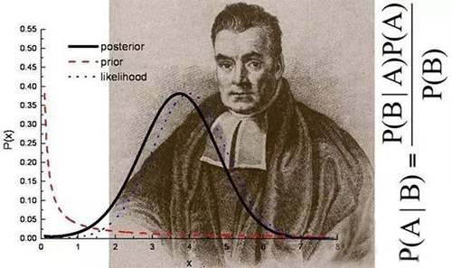

>辛普森悖论（Simpson's Paradox）亦有人译为辛普森诡论，为英国统计学家E.H.辛普森（E.H.Simpson）于1951年提出的悖论，即在某个条件下的两组数据，分别讨论时都会满足某种性质，可是一旦合并考虑，却可能导致相反的结论。(from 百度百科)关于辛普森悖论的统计学解释是贝叶斯置信网络在因果推论中的重要应用。

<!-- more -->

# 1  问题描述

考虑一个关于疾病用药的病人恢复情况的医学实验。两组实验分别在40个男性和40个女性中进行。实验数据如下所示：

实验探究的问题是：药物是否会提高病人的康复机率？根据第一个表格中的男性实验结果，服用药物和未服用药物的康复机率分别为60%和70%在第二个表格中的女性实验结果中，服用药物和未服用药物的康复机率分别为20%和30%。因此，从两组不同性别的分别实验可以看出，服用药物的康复机率更小。然而，如果不考虑性别信息，综合两组实验数据得到第三个表，服用药物和未服用药物的康复机率分别为50%和40%，由此得到与上面两组实验矛盾的结论，服用药物有助于疾病康复。这就是辛普森悖论的一个典型例子。

# 2  贝叶斯解释

统计学的观测证据（observation evidence）和介入证据（interventional evidence）往往是不同的，对于设计药物（D）对疾病恢复（R）的因果推论，用条件概率表示应该是$$P(R\|D)$$，而如果增加性别因素（G），条件概率为$$P(R\|G,D)$$，二者是不同的概念。

（1） 不考虑性别的影响的话，可以得到

$$P(R|D)=\frac{\sum_G{P(R|G,D)P(G)P(D)}}{\sum_G{P(D)P(G)}}=\sum_G{P(R|G,D)P(G)}$$

服用药物D=1，未服用D=0，带入表格数据有：

$$P(R|D=1)=0.6\times 0.5+0.2\times 0.5=0.4$$

$$P(R|D=0)=0.7\times 0.5+0.3\times 0.5=0.5$$

因此，服用药物的恢复机率是减小的的。

（2）考虑性别的影响的话，以男性G=1，女性G=0，由表中数据可以直接得到

$$P(R|G=1,D=1)=0.6$$

$$P(R|G=1,D=0)=0.7$$

$$P(R|G=0,D=1)=0.2$$

$$P(R|G=0,D=0)=0.3$$

因此，不管服用药物与否男性恢复机率都大于女性。

（3）引入无关影响因素$$P(D|G)$$
$$P(D|G)$$是指不同性别的服用药物比例，这个数值大小对于比较药物对疾病作用，还是药物对性别作用都是无关变量。
实际上，第三个表格中的联合计算方式是由以下公式得到的：

$$P(R|D)=\frac{\sum_G{P(R,G,D)P(G)}}{P(D)}=\frac{\sum_G{P(R|D,G)P(D|G)P(G)}}{P(D)}$$

这样做的话就违背了分层抽样原则，探究药物对疾病恢复机率的影响，如果按照性别不同分层，而对于每个分层里面应该进行随机抽样，即服用药物和未服用药物的人数应该一致。考虑不同性别对恢复机率的影响，男性的恢复机率（服药与未服药人数相同时）为

$$P(R|G=1)=0.5\times(0.6+0.7)=0.65$$

女性恢复机率（服药与未服药人数相同时）为：

$$P(R|G=1)=0.5\times(0.2+0.3)=0.25$$

由此可见，在不考虑药物作用下，男性的恢复机率远高于女性。而题干中的男性和女性分别为3:1和1:3的不同服用药物人数比例，直接导致了服药样本中高恢复机率的男性较多，低恢复机率的女性较少，而未服药样本反之，二者取样并不均匀，因此，由性别带来的取样差异性导致了错误的实验结论。

# 总结 

综上，辛普森悖论产生的原因来自于抽样调查时违背了抽样对象的随机性原则，使得与实验结论不相关的变量影响到了实验结果。在现实生活中，“统计平均陷阱”是辛普森悖论的一个重要表现形式。例如全国城市房价同比涨跌幅度，由于城市发展程度不同，各个城市房价不同，随着城市化进程加快，中小城市的房产交易规模扩增速度高于大城市，所以就会出现这样的情况：全国各个城市的房价都在增长，而房价均值同比却在下降。原因是由于中小城市的低价房产同比交易量高于大城市的高价房产同比交易量，所以全国总体房价的均值就被拉低了。

